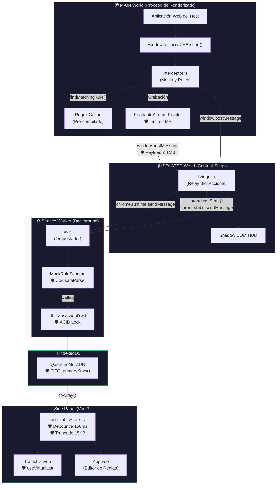

# ARCHITECTURE.md — Quantum Mock v1.0

## Documento de Diseño de Arquitectura (Staff-Level Design Doc)

---

## 1. Resumen Ejecutivo y Filosofía "Zero-Overhead"

**Quantum Mock** es una extensión de Chrome de grado Enterprise construida sobre **Manifest V3** cuyo propósito es interceptar, grabar y falsificar (mock) tráfico HTTP en tiempo real, directamente en la pestaña del desarrollador. A diferencia de herramientas proxy tradicionales como Charles Proxy o Fiddler —que operan a nivel de red del sistema operativo redirigiendo el tráfico a través de un servidor intermedio local—, Quantum Mock adopta una filosofía radicalmente diferente: **la intercepción ocurre dentro del mismo proceso de renderizado del navegador**, en el hilo JavaScript de la página, sin tocar la capa de red.

### ¿Por qué inyectar en el `MAIN World`?

Manifest V3 define dos mundos de ejecución para Content Scripts:

| Mundo | Acceso al DOM | Acceso a `window.fetch` / `XMLHttpRequest` | Aislamiento |
|---|---|---|---|
| **ISOLATED** (por defecto) | ✅ Sí | ❌ No — ve una copia prístina de los prototipos | Total respecto al JS de la página |
| **MAIN** | ✅ Sí | ✅ Sí — comparte el mismo `window` que la página | Ninguno — es código "inyectado" |

Un proxy de red intercepta peticiones **después** de que el motor de red de Chromium las haya procesado, lo que implica latencia de serialización, overhead de TLS (si se usa HTTPS), y la incapacidad de simular errores de red nativos como `TypeError: Failed to fetch`. 

Quantum Mock, al ejecutarse en el **MAIN World**, reemplaza directamente las funciones `window.fetch` y `XMLHttpRequest.prototype.send` **antes de que la aplicación web las invoque**. Esto significa:

1. **Latencia cero**: La respuesta mockeada se genera síncronamente en el mismo hilo V8 que ejecuta la petición. No hay round-trip de red.
2. **Fidelidad total**: La respuesta falsa es indistinguible de una respuesta real para la aplicación cliente, incluyendo status codes, headers personalizados y tiempos de latencia simulados.
3. **Capacidad de simular fallos**: Al operar antes de la capa de red, es posible lanzar un `TypeError` nativo o simular un `status: 0` en XHR, algo imposible desde un proxy externo.

> **Principio arquitectónico**: El código más rápido es el que nunca se ejecuta. Interceptar en el MAIN World elimina toda la pila de red del navegador (DNS → TCP → TLS → HTTP) del camino crítico.

---

## 2. Diagrama de Arquitectura de Datos

El siguiente diagrama ilustra el flujo de datos completo desde la petición HTTP de la página host hasta la persistencia en IndexedDB, pasando por las tres fronteras de aislamiento de Chrome. Los puntos marcados con 🛡️ representan **cuellos de botella mitigados**.



### Fronteras de Comunicación

| Frontera | Mecanismo | Coste de Serialización |
|---|---|---|
| MAIN → ISOLATED | `window.postMessage()` | Structured Clone Algorithm |
| ISOLATED → Service Worker | `chrome.runtime.sendMessage()` | JSON (Chrome IPC) |
| Service Worker → IndexedDB | Dexie.js (Wrapper sobre IDB) | IndexedDB Transaction |
| IndexedDB → Vue Store | `db.mockRules.toArray()` | Materialización completa |
| Vue Store → DOM | Virtual DOM Diffing (Vue 3 Proxy) | Proxy + VDOM Reconciliation |

Cada una de estas fronteras representa un punto potencial de congestión. Las secciones siguientes detallan cómo se ha mitigado cada uno.

---

## 3. Decisiones Arquitectónicas de Élite (Masterclass de Rendimiento)

### A. Sacar Carga del "Hot Path": El Caso del Regex

#### El Problema

La función `findMatchingRule()` se ejecuta en el **Hot Path** del interceptor: es invocada por cada petición `fetch()` y `XHR.send()` que realiza la página. En aplicaciones SPA modernas con polling, WebSockets degradados y precarga de recursos, esto puede representar **cientos de invocaciones por segundo**.

La implementación ingenua —la que un desarrollador sin experiencia en motores V8 escribiría— instanciaría un objeto `RegExp` dentro del bucle de búsqueda:

```javascript
// ❌ ANTES (Mediocre) — new RegExp() en el Hot Path
function findMatchingRule(url, method) {
  return rules.find(rule => {
    // Cada invocación de find() ejecuta esto N veces
    const regex = new RegExp(rule.urlPattern.replace(/\*/g, '.*'));
    return regex.test(url) && rule.method === method;
  });
}
```

#### ¿Por qué es destructivo a nivel de V8?

1. **Compilación JIT abortada**: V8 optimiza funciones "calientes" (ejecutadas frecuentemente) mediante TurboFan. Pero `new RegExp()` con un argumento dinámico (el string del patrón) es una operación que V8 clasifica como **megamórfica** — no puede predecir la forma del objeto resultante. Esto fuerza una **desoptimización** (bailout) de la función entera, revirtiendo al intérprete Ignition (hasta 100x más lento).

2. **Presión sobre el Garbage Collector**: Cada `new RegExp()` crea un objeto efímero que se abandona inmediatamente después del `.test()`. Con 50 reglas y 100 peticiones/segundo, se crean **5.000 objetos RegExp por segundo** que el Minor GC de V8 (Scavenge) debe recolectar, causando micro-pausas de 1-5ms que se acumulan como "jank" perceptible.

3. **Duplicación de trabajo**: El string `.replace(/\*/g, '.*')` realiza la misma transformación idéntica en cada invocación. Es trabajo puro desperdiciado.

#### La Solución Implementada: Pre-compilación Amortizada

```javascript
// ✅ DESPUÉS (Producción) — Regex pre-compilado en UPDATE_STATE
window.addEventListener('message', (event) => {
  if (event.data.type === 'UPDATE_STATE') {
    // La compilación ocurre UNA SOLA VEZ cuando las reglas cambian
    window.__quantumMockRules = (event.data.rules || []).map(rule => {
      try {
        const regexString = rule.urlPattern
          .replace(/[.+?^${}()|[\]\\]/g, '\\$&')
          .replace(/\*/g, '.*');
        rule.compiledRegex = new RegExp(regexString); // Compilar aquí
      } catch (e) {
        rule.compiledRegex = null;
      }
      return rule;
    });
  }
});

// El Hot Path ahora es O(1) — solo ejecuta .test()
function matchUrl(rule, url) {
  if (rule.compiledRegex) {
    return rule.compiledRegex.test(url); // Sin instanciación
  }
  return false;
}
```

**Análisis de complejidad**: La compilación se ejecuta `O(N)` veces donde `N` es el número de reglas, pero solo cuando el estado cambia (evento infrecuente, ~1 vez por minuto). La evaluación en el Hot Path es `O(1)` por regla — un simple `.test()` sobre un `RegExp` ya compilado y cacheado que V8 puede optimizar agresivamente como código monomórfico.

**Impacto medible**: Con 50 reglas activas y una aplicación haciendo 200 req/s, esta optimización elimina **10.000 instanciaciones de RegExp por segundo** y las reemplaza por llamadas `.test()` inlineables por TurboFan.

---

### B. Transmisión vs Buffering: El Caso de Transfer-Encoding Chunked

#### El Problema

Cuando el interceptor graba tráfico en modo "Shadow Recording", necesita leer el cuerpo de la respuesta HTTP para almacenarlo en la base de datos. La implementación ingenua utiliza `clone.text()`:

```javascript
// ❌ ANTES (Mediocre) — Buffering ciego
const clone = response.clone();
const contentLength = clone.headers.get('content-length');
if (contentLength <= 1048576) {
  const text = await clone.text(); // 💣 BOMBA DE MEMORIA
}
```

#### ¿Por qué es una bomba de relojería?

El problema radica en una suposición falsa: que `Content-Length` siempre está presente y es fiable. En la web moderna, la mayoría de servidores usan **`Transfer-Encoding: chunked`**, donde:

- La cabecera `Content-Length` está **ausente** (su valor será `null` o `0`).
- El cuerpo se transmite en fragmentos de tamaño arbitrario.
- El tamaño total es **desconocido hasta que se recibe el último chunk**.

Consecuencia: `clone.text()` esperará pacientemente a que **todos** los chunks lleguen, los concatenará en un único string en memoria, y lo devolverá. Si el servidor está transmitiendo un fichero de 500MB, `clone.text()` intentará materializar los 500MB como un string JavaScript en el heap de V8. El resultado es un **Out of Memory (OOM)** que crashea la pestaña del navegador.

Existe un segundo vector letal: **Server-Sent Events (SSE)**. Si la respuesta tiene `Content-Type: text/event-stream`, el stream **nunca se cierra** por diseño del protocolo. Ejecutar `await clone.text()` sobre un SSE cuelga la promesa **infinitamente**, acumulando datos en el heap sin resolución posible.

#### La Solución Implementada: Lectura Streaming con Circuit Breaker

```javascript
// ✅ DESPUÉS (Producción) — ReadableStream con límite de seguridad
const isStreaming = contentType.includes('text/event-stream');
const isText = (contentType.includes('application/json') 
  || contentType.includes('text/')) && !isStreaming;

if (isText && clone.body) {
  const reader = clone.body.getReader();      // Acceso al stream nativo
  const decoder = new TextDecoder();
  let totalRead = 0;
  let chunks = '';
  
  while (true) {
    const { done, value } = await reader.read(); // Lectura chunk-a-chunk
    if (done) break;
    
    if (value) {
      totalRead += value.length;
      chunks += decoder.decode(value, { stream: true });
      
      // CIRCUIT BREAKER: Desconectar el stream si supera 1MB
      if (totalRead > 1048576) {
        reader.cancel();    // Libera el lock del stream
        chunks += "\n...[TRUNCATED BY QUANTUM: PAYLOAD CHUNKED TOO LARGE]";
        break;
      }
    }
  }
  chunks += decoder.decode(); // Flush del decoder
  safeBody = chunks;
}
```

**Análisis técnico del patrón**:

1. **`clone.body.getReader()`** devuelve un `ReadableStreamDefaultReader` que permite consumir el stream chunk a chunk, sin materializar el cuerpo completo.
2. **El acumulador `totalRead`** lleva la cuenta de bytes reales recibidos (no caracteres — `value` es un `Uint8Array`), independientemente de lo que digan las cabeceras HTTP.
3. **`reader.cancel()`** es el "circuit breaker": libera el lock del stream, señaliza al navegador que puede descartar los chunks pendientes, y evita que la conexión TCP subyacente siga transfiriendo datos innecesarios.
4. **`TextDecoder` con `{ stream: true }`** maneja correctamente caracteres UTF-8 multi-byte que podrían quedar partidos entre dos chunks.

**Consumo de memoria**: Constante y acotado. El pico máximo es de ~1MB (el string acumulado) + el tamaño del último chunk (~64KB típico). Frente a los potenciales **gigabytes** del enfoque de buffering.

---

### C. La Ilusión del DOM vs La RAM Reactiva: El Caso de Vue 3

#### El Problema

Un error frecuente en aplicaciones Vue 3 es asumir que la virtualización del DOM (renderizar solo los elementos visibles en pantalla) resuelve todos los problemas de rendimiento. Esto es una **ilusión**. La virtualización controla el número de **nodos DOM**, pero el consumo de memoria del sistema de reactividad de Vue 3 es proporcional al **volumen de datos en el Store**, no al número de nodos renderizados.

Vue 3 utiliza **Proxies de ES6** para implementar la reactividad. Cuando se asigna un objeto a una variable `ref()`, Vue envuelve **recursivamente** cada propiedad anidada en un Proxy. Para un array de 1.000 reglas donde cada regla contiene un body JSON de 2MB:

```
Coste de memoria = 1000 reglas × 2MB de body × ~2.5x (overhead del Proxy)
                 ≈ 5GB de RAM reactiva
```

El factor `2.5x` proviene de que cada Proxy mantiene:
- Una referencia al objeto original (target).
- Un mapa de dependencias (dep tracking Map).
- Metadatos internos de Vue (`__v_raw`, `__v_isReactive`, etc.).

#### La Solución Implementada: Truncado Defensivo Pre-Proxy

El truncado se realiza **antes** de que los datos entren en el sistema reactivo de Vue, directamente en el composable `useTrafficStore.ts`:

```javascript
// ✅ DESPUÉS (Producción) — Data Trimming antes de la asignación reactiva
const executeLoad = async () => {
  const rawRules = await db.mockRules.toArray();
  
  for (const r of rawRules) {
    // Truncar requestBody si excede 15KB
    if (r.capturedTraffic?.requestBody?.length > 15000) {
      r.capturedTraffic.requestBody = 
        r.capturedTraffic.requestBody.substring(0, 15000) 
        + '\n...[Contenido truncado en vista de lista...]';
    }
    
    // Truncar response bodies si exceden 15KB
    r.responses?.forEach(res => {
      if (res.body?.length > 15000) {
        res.body = res.body.substring(0, 15000) 
          + '\n...[Contenido truncado en vista de lista...]';
      }
    });
  }
  
  // Solo AHORA Vue envuelve los datos en Proxies
  rules.value = migratedRules; 
};
```

**Impacto cuantificable**: Con 1.000 reglas y payloads de 2MB promedio, el consumo de RAM pasa de ~5GB (crash asegurado) a `1000 × 15KB × 2.5 ≈ 37.5MB` — una reducción del **99.3%**.

El debounce complementa esta defensa. Sin él, 100 peticiones interceptadas en 50ms dispararían 100 llamadas a `executeLoad()`, cada una realizando un `toArray()` completo contra IndexedDB y una reasignación a `rules.value` que fuerza un ciclo completo de invalidación de Proxies. El debounce de 150ms colapsa estas 100 señales en **una sola** mutación de estado.

---

### D. Garbage Collection de Consumo Constante O(1): El Caso de Dexie

#### El Problema

La base de datos IndexedDB funciona como un buffer circular: cuando el modo de grabación ("Shadow Recording") está activo, cada petición que la página realiza genera un registro nuevo. Sin un mecanismo de limpieza, la base de datos crecería sin límite hasta consumir todo el almacenamiento disponible del perfil de Chrome.

La implementación ingenua —y la primera que un desarrollador consultaría en la documentación de Dexie— sería:

```javascript
// ❌ ANTES (Mediocre) — Volcado completo a RAM para limpiar
const allRules = await db.mockRules.toArray();  // 💣 Materializa TODO
if (allRules.length >= 1000) {
  const toDelete = allRules.slice(0, allRules.length - 999);
  for (const rule of toDelete) {
    await db.mockRules.delete(rule.id);  // N operaciones individuales
  }
}
await db.mockRules.put(newRule);
```

#### ¿Por qué causa OOM?

1. **`toArray()` materializa TODA la tabla en el heap de JavaScript**. Si hay 1.000 reglas con payloads de 200KB cada una, esto aloca ~200MB de RAM de golpe en el Service Worker.
2. **El borrado individual** (`delete` en un bucle) ejecuta N transacciones IDB separadas, cada una con su propio overhead de journaling WAL.
3. **Sin protección transaccional**: entre el `toArray()` y el `delete`, nuevas reglas pueden insertarse concurrentemente, corrompiendo la lógica de limpieza.

#### La Solución Implementada: Operaciones sobre Índices con Transacciones Atómicas

```javascript
// ✅ DESPUÉS (Producción) — Limpieza O(1) en RAM, atómica
const cleanUpAndSave = async () => {
  await db.transaction('rw', db.mockRules, async () => {
    const count = await db.mockRules.count();       // O(1) — lee metadato del índice
    if (count >= 1000) {
      const excess = count - 999;
      const oldKeys = await db.mockRules
        .orderBy('id')
        .limit(excess)
        .primaryKeys();                              // Solo extrae las claves, no los objetos
      await db.mockRules.bulkDelete(oldKeys);        // Borrado en lote optimizado
    }
    await db.mockRules.put(validNewRule);             // Inserción dentro de la transacción
  });
};
```

**Análisis de la solución**:

| Operación | Consumo de RAM | Descripción |
|---|---|---|
| `.count()` | `O(1)` | Lee un metadato del índice B-Tree de IDB. No carga ningún registro. |
| `.orderBy('id').limit(N).primaryKeys()` | `O(N)` sobre las **claves** | Recorre el índice primario y extrae solo los strings UUID. Con N=100, esto son ~3.6KB. |
| `.bulkDelete(keys)` | `O(1)` en heap JS | Delega al motor de IDB el borrado en lote. El motor opera directamente sobre el almacenamiento en disco sin deserializar los registros. |

**Consumo total de RAM de la limpieza**: `O(N)` donde N es el número de claves a borrar, y cada clave es un UUID de 36 bytes. Para borrar 100 registros sobrantes: `100 × 36 bytes = 3.6KB`. Frente a los **200MB** del enfoque de materialización completa.

**Protección transaccional**: El bloque `db.transaction('rw')` garantiza **aislamiento ACID**. Si llegan 200 peticiones concurrentes al Service Worker, Dexie (que delega en la implementación nativa de transacciones IDB) las encola y ejecuta secuencialmente. No es posible que dos transacciones lean `count = 999` simultáneamente y ambas inserten sin borrar.

---

## 4. Stack Tecnológico y Configuración CSP

### Justificación del Stack

| Tecnología | Versión | Justificación |
|---|---|---|
| **Vite** | 8.x | Bundler basado en ESBuild (compilación) + Rollup (producción). Compilaciones sub-segundo. |
| **Vue 3** (Composition API) | 3.5.x | Los composables (`useTrafficStore`) permiten extraer lógica reactiva sin el overhead de un store global como Pinia/Vuex. |
| **Rollup** (via Vite) | Integrado | Multi-entry builds nativos. Permite generar 4 bundles aislados desde un único `vite.config.ts`. |
| **Dexie.js** | 4.x | Wrapper tipado sobre IndexedDB con soporte nativo de transacciones ACID y operaciones sobre índices. |
| **Zod** | 4.x | Validación de esquemas en runtime. `safeParse()` no lanza excepciones, devuelve un discriminated union tipado. |
| **@vueuse/core** | 14.x | `useVirtualList` para renderizado virtualizado sin dependencias pesadas. |
| **TypeScript** | 6.x (strict) | Compilación con `"strict": true` para null-safety y eliminación de coerciones implícitas. |

### Configuración Multi-Entry de Rollup

La configuración de Vite define **cuatro puntos de entrada independientes** que se compilan a bundles aislados:

```typescript
rollupOptions: {
  input: {
    sidepanel:    resolve(__dirname, 'index.html'),          // Vue 3 SPA
    background:   resolve(__dirname, 'src/background/sw.ts'), // Service Worker
    content:      resolve(__dirname, 'src/content/bridge.ts'),// Isolated World
    interceptor:  resolve(__dirname, 'src/content/interceptor.ts'), // MAIN World
  },
  output: {
    entryFileNames: 'assets/[name].js',  // Sin hashes — requerido por MV3
    chunkFileNames: 'assets/[name].js',
    assetFileNames: 'assets/[name].[ext]',
  }
}
```

**Decisión clave — Sin hashes en nombres de archivo**: Manifest V3 requiere que los paths en `manifest.json` sean estáticos (`"assets/background.js"`). Los hashes dinámicos que Vite genera por defecto (`background.a3f2c.js`) romperían las referencias del manifiesto.

### Tipado Estricto con `global.d.ts`

Manifest V3 prohíbe `eval()` y derivados. TypeScript en modo `strict` actúa como segunda línea de defensa compilando errores que en runtime serían `undefined is not a function`.

El archivo `src/types/global.d.ts` extiende las interfaces globales del navegador para declarar las propiedades inyectadas por el interceptor:

```typescript
export {};
declare global {
  interface Window {
    __quantumMockRules: any[];
    __quantumIsRecording: boolean;
  }
  interface XMLHttpRequest {
    _quantumMethod?: string;
    _quantumUrl?: string;
    _quantumReqHeaders?: Record<string, string>;
    _quantumReqBody?: string;
  }
}
```

Esto elimina la necesidad de casteos `(window as any)` o `(this as any)`, permitiendo que el compilador TypeScript valide estáticamente cada acceso a `window.__quantumIsRecording` o `this._quantumUrl` y detecte typos, accesos sin null-check, y mutaciones ilegales **en tiempo de compilación**.

### Cumplimiento CSP de Manifest V3

Manifest V3 impone una Content Security Policy restrictiva: `script-src 'self'`. Esto prohíbe:
- `eval()`, `new Function()`, y cualquier ejecución de código dinámico.
- `<script>` inline con hashes dinámicos.

Quantum Mock cumple esta política porque:
1. Todo el código se pre-compila a bundles estáticos mediante Vite/Rollup.
2. El interceptor se inyecta como archivo `.js` referenciado en el manifiesto (`"world": "MAIN"`), no mediante `chrome.scripting.executeScript` con strings de código.
3. La validación Zod usa `.safeParse()` (evaluación de esquemas basada en funciones puras), sin ejecutar código dinámico.

---

## 5. Arquitectura Lazy Loading

### El Problema del Peso Estático

El dashboard incluye un diccionario HTTP (`http-dictionary.json`, ~11KB comprimido) que contiene definiciones de cabeceras HTTP, códigos de estado y protocolos. Cargar este recurso de forma síncrona durante el `onMounted()` del componente principal retrasaría el **Time to Interactive (TTI)** del panel lateral.

### La Solución: Dynamic Import con Code Splitting

En `knowledge.ts`, el diccionario se carga bajo demanda mediante un `import()` dinámico:

```typescript
export const loadHttpDictionary = async () => {
  if (Object.keys(activeDictionary.value).length > 0) return; // Guard: ya cargado
  
  isDictionaryLoading.value = true;
  try {
    // Vite genera un chunk separado: assets/http-dictionary.js
    const module = await import('../../assets/http-dictionary.json');
    const staticDict = module.default as Record<string, KnowledgeEntry>;
    
    // Merge con diccionario personalizado del usuario
    const data = await chrome.storage.local.get('customDictionary');
    const customDict = (data.customDictionary || {}) as Record<string, KnowledgeEntry>;
    
    activeDictionary.value = { ...staticDict, ...customDict };
  } finally {
    isDictionaryLoading.value = false;
  }
};
```

**Comportamiento de Rollup**: Al detectar el `import()` dinámico, Rollup extrae `http-dictionary.json` a un chunk separado (`assets/http-dictionary.js`, 10.81KB). Este chunk **nunca se descarga** hasta que el usuario navega a una pestaña del Inspector que lo necesite.

**Impacto en TTI**: El bundle principal del sidepanel (`sidepanel.js`, 105KB) se carga y ejecuta sin esperar al diccionario. El usuario puede interactuar con el editor de reglas inmediatamente. El diccionario se materializa en background cuando (y solo cuando) se accede al Inspector de Headers.

---

*Quantum Mock v1.0 — Documento de Arquitectura — Última revisión: Mayo 2026*
