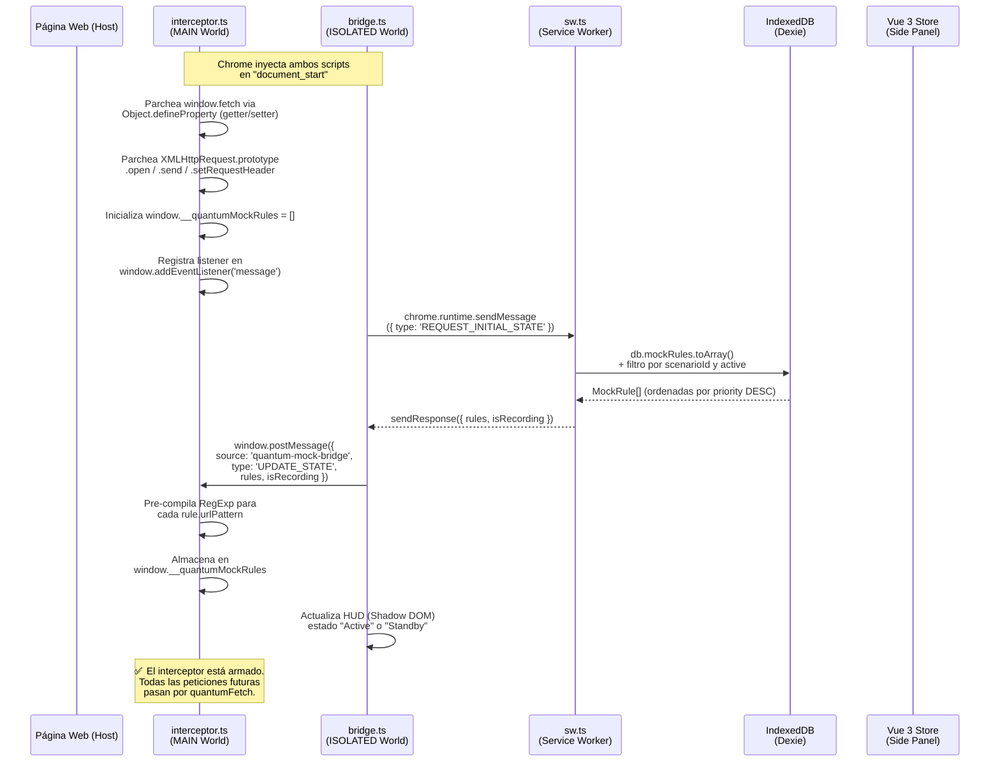
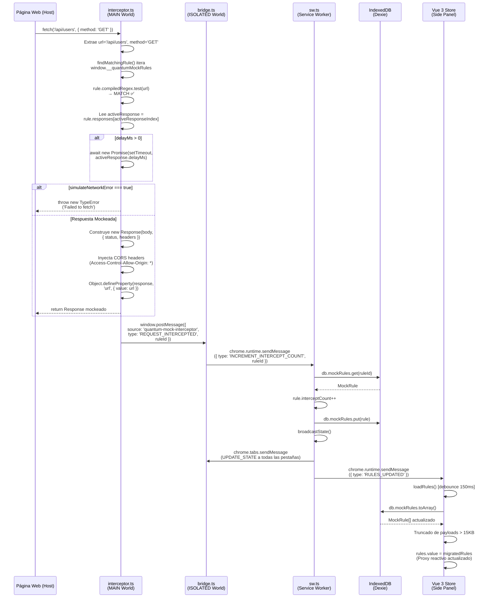

# EXECUTION_FLOW.md — Quantum Mock v1.0

## Volumen II: Flujo de Ejecución y Anatomía Interna

---

## 1. Diagrama de Secuencia del Ciclo de Vida

### Flujo 1: Inicialización — Carga de Reglas desde IndexedDB hasta el MAIN World

Este flujo se ejecuta **una vez por pestaña** cuando Chrome inyecta los Content Scripts al navegar a cualquier URL.



### Flujo 2: Intercepción de una Petición con Match Positivo

Este flujo se ejecuta cada vez que la aplicación web invoca `fetch()` o `XHR.send()` y existe una regla coincidente.



---

## 2. Matriz de Dependencias: El "Por Qué" de Cada Paquete

### Dependencias de Producción

#### `zod` v4.4 — La Frontera de Confianza (I/O Boundary)

**Decisión**: Toda extensión de Chrome que recibe datos desde el navegador opera en un entorno inherentemente hostil. Los mensajes que llegan a través de `chrome.runtime.onMessage` o `window.postMessage` son objetos JavaScript arbitrarios que cualquier script en la página —o cualquier otra extensión— puede emitir. Sin validación, estos objetos se insertan directamente en IndexedDB, creando un vector de **inyección de datos** que puede corromper el estado de la aplicación.

**Alternativas descartadas**:
| Alternativa | Motivo del Descarte |
|---|---|
| Validación manual (`if/typeof`) | No escala. Con 12 campos anidados y tipos opcionales, el código de validación sería más largo que el esquema mismo. Además, no genera tipos TypeScript. |
| `joi` / `yup` | Diseñados para Node.js. Arrastran polyfills de `Buffer` y `process` que inflan el bundle en un entorno de extensión. |
| `io-ts` | Requiere conocimiento profundo de programación funcional (fp-ts). Barrera de entrada inaceptable para contribuidores. |
| Confiar en TypeScript | TypeScript es una herramienta **exclusivamente de compilación**. Los tipos desaparecen en runtime. Un `JSON.parse()` devuelve `any` independientemente de la anotación. |

**Implementación**: Zod opera como un **firewall de esquema** en dos puntos críticos:

1. **Service Worker** (`sw.ts`, línea 98): Todo payload de `RECORD_TRAFFIC` pasa por `MockRuleSchema.safeParse(newRule)`. Si falla, el registro se descarta silenciosamente con un `console.error`, protegiendo IndexedDB de datos malformados.

2. **Dashboard** (`App.vue`, importHub): Toda importación Base64 de configuración se parsea con `MockRuleSchema.array().safeParse()`. Esto previene que un usuario inyecte reglas con campos faltantes o tipos incorrectos que crashearían el editor.

La elección de `safeParse()` sobre `parse()` es deliberada: `parse()` lanza una excepción en caso de error, lo que requiere un `try/catch` y puede causar Unhandled Rejection si se omite. `safeParse()` devuelve un **Discriminated Union** tipado (`{ success: true, data } | { success: false, error }`) que TypeScript obliga a manejar en ambas ramas.

---

#### `dexie` v4.4 — Abstracción de IndexedDB con Operaciones B-Tree

**Decisión**: La API nativa de IndexedDB es notoriamente hostil: orientada a eventos, basada en callbacks (`onsuccess`/`onerror`), y sin soporte nativo de Promises. Escribir una transacción de lectura-escritura atómica en IDB nativo requiere ~40 líneas de código boilerplate. Dexie las reduce a 5.

**Alternativas descartadas**:
| Alternativa | Motivo del Descarte |
|---|---|
| `chrome.storage.local` | Límite de 10MB (con `unlimitedStorage`, depende de la plataforma). Sin índices. Sin transacciones ACID. Toda lectura devuelve el objeto completo — no permite queries como `where('scenarioId').equals(x)`. |
| IDB nativa (`indexedDB.open`) | Viable pero extremadamente verbosa. Sin tipado. Sin helper para `.count()`, `.primaryKeys()`, `.bulkDelete()`, `.orderBy()`. Cada operación requiere abrir una transacción manualmente. |
| `localForage` | Abstracción demasiado simple. No expone índices secundarios ni operaciones en lote. Es un wrapper key-value, no un motor de queries. |

**Capacidades críticas usadas en Quantum Mock**:

1. **Índices compuestos** (`db.ts`, línea 10): `'id, scenarioId, active, urlPattern, method, priority'` — Dexie genera índices B-Tree sobre cada campo listado, permitiendo queries como `where('scenarioId').equals(id)` sin escaneo secuencial.

2. **Transacciones atómicas** (`sw.ts`, línea 108): `db.transaction('rw', db.mockRules, async () => {...})` — Garantiza que la secuencia `count → delete → put` se ejecute como una operación atómica. Dexie encola transacciones `rw` sobre la misma tabla y las ejecuta secuencialmente, eliminando las race conditions que causarían estados fantasma bajo concurrencia.

3. **Operaciones sobre índices sin materialización** (`sw.ts`, línea 112): `.orderBy('id').limit(excess).primaryKeys()` — Recorre el índice primario y extrae exclusivamente las claves UUID, sin deserializar los objetos almacenados. Complejidad de memoria: `O(K × 36 bytes)` donde K es el número de claves.

---

#### `@vueuse/core` v14.3 — Virtualización del DOM (`useVirtualList`)

**Decisión**: Cuando el modo de grabación ("Shadow Recording") ha estado activo durante una sesión de desarrollo, la base de datos puede acumular cientos o miles de reglas. Renderizar 1.000 nodos DOM de tarjetas de regla (cada uno con ~15 elementos hijos: checkbox, label, toggle, badges) significa instanciar **~15.000 nodos DOM simultáneamente**. 

**El cálculo del coste**: Cada nodo DOM en Chromium consume entre 0.5KB y 2KB de RAM (dependiendo de atributos, listeners y estilos computados). Con 15.000 nodos:

```
15.000 nodos × 1KB promedio = ~15MB de RAM exclusivamente en DOM
+ Coste de layout/reflow en cada mutación = O(N) donde N es el total de nodos
```

Además, cualquier cambio de estado (activar/desactivar una regla) provoca un **reflow** que Blink (el motor de renderizado de Chrome) debe recalcular para los 15.000 nodos, causando frames de >16ms que se perciben como "jank" (tartamudeo visual).

**La solución matemática**: `useVirtualList` solo renderiza los nodos que caben en el viewport visible + un margen de `overscan: 10`. Con una altura de panel de ~600px y tarjetas de ~120px:

```
Nodos renderizados = ceil(600 / 120) + 10 overscan = 15 nodos
Nodos DOM reales   = 15 × 15 hijos = ~225 nodos (constante)
```

**Resultado**: El coste de renderizado es `O(1)` respecto al tamaño del dataset, con un techo fijo de ~225 nodos independientemente de si hay 10 o 10.000 reglas en la base de datos.

**Alternativas descartadas**:
| Alternativa | Motivo del Descarte |
|---|---|
| `vue-virtual-scroller` | Paquete independiente con dependencias propias. `@vueuse/core` ya ofrece `useVirtualList` y se reutiliza para otros composables potenciales (debounce, clipboard, etc.). Una sola dependencia en lugar de dos. |
| Paginación manual | Destruye la experiencia de usuario. El desarrollador espera un scroll fluido, no paginar entre "Página 1 de 50". |
| Renderizado incremental (`v-for` con `slice`) | No resuelve el problema de reflow. Si se muestran 50 elementos, Blink recalcula los 50 en cada mutación. Además, la lógica de `slice` manual es frágil y difícil de sincronizar con el scroll. |

---

#### `tailwindcss` v4.3 — Purga Agresiva de CSS

**Decisión**: En una extensión de Chrome, cada kilobyte del bundle impacta el tiempo de inyección de los Content Scripts. Tailwind CSS opera mediante un compilador que escanea los archivos fuente y genera **exclusivamente** las clases utilizadas, descartando el resto del framework.

**Impacto medido en el build de producción**:

```
dist/assets/sidepanel.css    38.46 kB │ gzip:  6.85 kB
```

El CSS completo de Tailwind (sin purga) pesaría ~300KB. Tras la purga JIT, el resultado es **38.46KB** (6.85KB comprimido), una reducción del **87%**.

**Alternativas descartadas**:
| Alternativa | Motivo del Descarte |
|---|---|
| Vuetify / Element Plus | Frameworks de componentes que arrastran 200-500KB de JavaScript + CSS propio. Inaceptable para una extensión que se inyecta en cada pestaña. |
| CSS Modules / Scoped | No proporcionan un sistema de diseño. Cada desarrollador reinventa colores, espaciados y tipografías. Inconsistencia visual garantizada. |
| CSS vanilla sin framework | Viable para proyectos pequeños, pero sin utilidades de responsive, dark mode, y sistema de spacing consistente, el CSS crece desordenadamente. |

---

### Dependencias de Desarrollo

| Paquete | Justificación |
|---|---|
| `@types/chrome` | Definiciones TypeScript para la API completa de `chrome.*`. Sin ellas, `chrome.runtime.sendMessage` sería `any`. |
| `@vitejs/plugin-vue` | Plugin de Vite para compilar SFCs (`.vue`) con `<script setup>` y `<template>`. |
| `vue-tsc` | Type-checker de Vue que entiende la semántica de `<template>` (a diferencia de `tsc` nativo que solo valida `<script>`). Se ejecuta **antes** de Vite en el comando `build`. |
| `typescript` v6 | Compilador con `"strict": true`. Activado en el pipeline como gate de calidad: si `vue-tsc` falla, Vite no se ejecuta y el build aborta. |

---

## 3. Anatomía de Archivos: Decisiones por Módulo

### Árbol de Directorios

```
quantum-mock/
├── public/
│   ├── manifest.json            # Manifiesto MV3 — Declaración de mundos
│   └── icon-*.png               # Iconos de la extensión
├── src/
│   ├── assets/
│   │   └── http-dictionary.json # Diccionario HTTP (lazy loaded)
│   ├── background/
│   │   └── sw.ts                # Service Worker — Orquestador global
│   ├── content/
│   │   ├── interceptor.ts       # MAIN World — Monkey-patch de red
│   │   └── bridge.ts            # ISOLATED World — Relay bidireccional
│   ├── db/
│   │   └── db.ts                # Instancia singleton de Dexie
│   ├── schema/
│   │   └── mockRule.ts          # Esquema Zod — SSOT de tipos
│   ├── types/
│   │   └── global.d.ts          # Extensiones de Window y XHR
│   └── ui/
│       └── dashboard/
│           ├── App.vue           # Orquestación visual
│           ├── main.ts           # Bootstrap de Vue
│           ├── index.css         # Tailwind + tema cyber
│           ├── knowledge.ts      # Lazy-loader del diccionario
│           ├── composables/
│           │   └── useTrafficStore.ts  # Store reactivo
│           └── components/
│               ├── TrafficList.vue      # Lista virtualizada
│               ├── JsonViewer.vue       # Árbol JSON recursivo
│               ├── InspectorPayload.vue # Vista de payloads
│               ├── InspectorDictView.vue# Vista de headers
│               ├── StatusCodeSelect.vue # Selector de status
│               └── CyberSelect.vue      # Dropdown estilizado
├── vite.config.ts               # Build multi-entry
├── tsconfig.json                # TypeScript strict
└── package.json                 # Dependencias
```

---

### `src/content/interceptor.ts` — El Monkey-Patch de la Capa de Red

**Responsabilidad**: Residir permanentemente en el hilo JavaScript de la página host (MAIN World) y sustituir las funciones nativas `window.fetch` y `XMLHttpRequest.prototype.send` por versiones controladas que evalúan cada petición contra las reglas almacenadas.

**Decisión 1 — Monkey-Patching como estrategia de intercepción**:

El término "monkey-patching" describe la técnica de reemplazar métodos de objetos nativos del navegador en tiempo de ejecución. En este caso, `interceptor.ts` reemplaza `window.fetch` por `quantumFetch`, una función que:

1. Extrae `url` y `method` del argumento `input` (que puede ser un `string`, un `URL` o un `Request`).
2. Ejecuta `findMatchingRule(url, method)` contra el cache de regex pre-compilados.
3. **Si hay match**: Construye un `new Response()` sintético con el body, status y headers configurados en la regla, y lo devuelve inmediatamente. La petición **nunca toca la red**.
4. **Si no hay match**: Delega a `originalFetch(input, init)` — la referencia preservada a la función nativa — y el navegador procesa la petición normalmente.

**Decisión 2 — Protección contra re-escritura (`Object.defineProperty`)**: 

Librerías de observabilidad como Sentry, Datadog o New Relic operan con la misma técnica de monkey-patching. Si se cargan **después** de nuestra extensión, sobrescribirían `window.fetch` con su propia versión, anulando silenciosamente nuestro interceptor. Para blindarnos, en lugar de la asignación directa `window.fetch = quantumFetch`, se instala un **Descriptor de Propiedad** reactivo:

```typescript
Object.defineProperty(window, 'fetch', {
  get: () => currentFetch,
  set: (newFetch) => {
    currentFetch = async (...args) => {
      return newFetch.apply(window, args);
    };
  },
  configurable: true,
  enumerable: true
});
```

Cuando Sentry ejecuta `window.fetch = sentryFetch`, el `setter` intercepta la asignación y envuelve la función de Sentry **dentro** de la nuestra. Sentry cree que es el dueño de `fetch`, pero en realidad opera como middleware sobre `quantumFetch`. Ambas herramientas coexisten sin conflicto.

**Decisión 3 — Simulación de errores de red nativos**:

Para las peticiones `fetch` mockeadas, el interceptor lanza `throw new TypeError('Failed to fetch')` — idéntico al error que Chrome genera cuando una petición de red falla. Para XHR, se usa `Object.defineProperties` para inyectar `readyState: 4`, `status: 0` y se disparan los eventos `error` y `loadend` mediante `dispatchEvent`. Esto permite que librerías como Axios o Angular HttpClient detecten el fallo a través de sus mecanismos nativos de error handling.

---

### `src/content/bridge.ts` — El Túnel Inter-Mundos

**Responsabilidad**: Actuar como relay bidireccional entre el MAIN World (que tiene acceso a `window.fetch` pero no a `chrome.*`) y el Service Worker (que tiene acceso a `chrome.*` pero no al DOM de la página).

**¿Por qué existe este archivo?**

Chrome impone un modelo de seguridad estricto basado en "mundos" de ejecución. El Content Script en `ISOLATED World` es el **único** contexto que tiene acceso simultáneo a:
- `window.postMessage()` — para comunicarse con el MAIN World.
- `chrome.runtime.sendMessage()` — para comunicarse con el Service Worker.

Sin el bridge, el interceptor en MAIN World no podría enviar datos al Service Worker (porque `chrome.*` no existe en su scope), y el Service Worker no podría enviar reglas actualizadas al interceptor (porque no puede inyectar mensajes en `window`).

**Mecanismo de seguridad — Filtrado por `source`**: 

Toda extensión de Chrome que esté instalada en el navegador del usuario comparte el mismo canal de `postMessage` en el MAIN World. Para evitar procesar mensajes emitidos por otras extensiones o por la propia página host, el bridge filtra estrictamente por el campo `source`:

```typescript
// bridge.ts — Solo procesa mensajes de NUESTRO interceptor
if (event.source !== window || event.data.source !== 'quantum-mock-interceptor') return;

// interceptor.ts — Solo procesa mensajes de NUESTRO bridge
if (event.source !== window || event.data.source !== 'quantum-mock-bridge') return;
```

Este doble filtrado crea un **canal virtual privado** sobre el medio compartido de `postMessage`.

**HUD en Shadow DOM**: El bridge también gestiona un indicador visual (HUD) inyectado en la esquina inferior derecha de cada página mediante `attachShadow({ mode: 'open' })`. El Shadow DOM garantiza que los estilos CSS de la página host no contaminen el HUD, y viceversa. El `z-index: 2147483647` (máximo valor de un entero de 32 bits con signo) garantiza que el HUD siempre esté visible por encima de cualquier elemento de la página.

---

### `src/background/sw.ts` — El Orquestador Global

**Responsabilidad**: Funcionar como el cerebro de la extensión. El Service Worker no tiene acceso al DOM ni a las páginas, pero es el **único contexto** con acceso simultáneo a IndexedDB (vía Dexie), `chrome.storage.local`, y la capacidad de comunicarse con **todas** las pestañas abiertas.

**Router de Eventos**: El Service Worker implementa un patrón de message router con cuatro tipos de mensaje:

| Tipo de Mensaje | Origen | Acción |
|---|---|---|
| `REQUEST_INITIAL_STATE` | bridge.ts | Lee reglas activas de IDB, las ordena por prioridad y responde con `sendResponse()`. |
| `RULES_UPDATED` | Dashboard (Vue) | Ejecuta `broadcastState()` — lee el estado actual de IDB y lo distribuye a todas las pestañas via `chrome.tabs.sendMessage()`. |
| `INCREMENT_INTERCEPT_COUNT` | bridge.ts | Incrementa `rule.interceptCount` en IDB y re-distribuye el estado actualizado. |
| `RECORD_TRAFFIC` | bridge.ts | Crea una nueva `MockRule` a partir del payload de tráfico capturado, la valida con Zod, y la persiste en IDB dentro de una transacción atómica con limpieza FIFO. |

**Patrón `broadcastState()` — Sincronización de Estado Multi-Pestaña**:

Cuando las reglas cambian (creación, edición, borrado, grabación de tráfico), el Service Worker ejecuta `broadcastState()`, que envía el conjunto completo de reglas activas a **todas** las pestañas del navegador. Esto garantiza que si el usuario modifica una regla en el Dashboard, todas las pestañas que están siendo interceptadas reciban instantáneamente las reglas actualizadas sin necesidad de recargar.

---

### `src/schema/mockRule.ts` — Single Source of Truth (SSOT)

**Responsabilidad**: Definir la forma canónica de los datos que fluyen por toda la aplicación.

**Decisión de diseño**: El esquema Zod **genera** los tipos TypeScript mediante `z.infer<>`. Esto significa que no existe una definición de tipo separada (un `interface MockRule { ... }`) que pueda divergir del esquema de validación. El tipo y la validación son **el mismo objeto**. Si se añade un campo al esquema, el tipo se actualiza automáticamente, y todos los consumidores del tipo son alertados por el compilador si no manejan el nuevo campo.

```typescript
// El esquema ES el tipo. No hay duplicación.
export const MockRuleSchema = z.object({ ... });
export type MockRule = z.infer<typeof MockRuleSchema>;
```

**Esquema de Respuesta** (`ResponseDefSchema`): Define restricciones numéricas estrictas como `z.number().int().min(100).max(599)` para el status HTTP. Esto previene que un payload corrupto inyecte un status `-1` o `999` que causaría comportamiento indefinido en `new Response()`.

---

### `src/ui/dashboard/composables/useTrafficStore.ts` — Store Sin Framework

**Responsabilidad**: Centralizar toda la interacción con Dexie y gestionar el estado reactivo de las reglas.

**¿Por qué no Pinia o Vuex?**

La extensión opera como un Side Panel — una SPA de una sola ruta sin necesidad de un store global complejo. Pinia añadiría ~8KB al bundle, un sistema de plugins, soporte para SSR, y devtools — ninguno de los cuales se necesita. Un composable con `ref()` y funciones exportadas proporciona la misma funcionalidad con **cero dependencias adicionales** y tipado nativo de TypeScript.

**Patrón de Debounce de 150ms**: 

Cuando el modo de grabación está activo, cada petición interceptada genera un mensaje `RULES_UPDATED` desde el Service Worker. Si la página web realiza 100 peticiones en 50ms (un escenario común durante la carga inicial de una SPA), el listener `chrome.runtime.onMessage` se dispararía 100 veces, cada uno invocando `loadRules()`. Sin debounce, esto generaría:

- 100 consultas `toArray()` a IndexedDB.
- 100 asignaciones a `rules.value`, cada una forzando un ciclo completo de invalidación de Proxies de Vue.
- 100 re-evaluaciones de la computación `flatItems` en `TrafficList.vue`.

El debounce colapsa estas 100 señales en **una sola** ejecución después de 150ms de calma. El `isLoading` mutex previene que ejecuciones superpuestas (si la latencia de IDB excede 150ms) consuman Dexie simultáneamente.

**Truncado de Payloads Pre-Reactivos**:

Vue 3 envuelve recursivamente en Proxies todo objeto asignado a un `ref()`. Para un string de 2MB, Vue debe crear un Proxy que monitoriza accesos de lectura y escritura sobre la referencia. Al truncar strings por encima de 15.000 caracteres **antes** de la asignación, el overhead de reactividad se mantiene proporcional a los metadatos de la regla (~1KB), no al tamaño del payload crudo.

---

## 4. El Ciclo de Vida de los Datos: Paso a Paso

> **Escenario**: El usuario activa "Shadow Recording" en el Dashboard y navega a `https://example.com`, cuya SPA ejecuta `fetch('/api/users')`.

### Fase A — Activación de la Grabación

**Paso 1**: El usuario hace clic en el toggle "SHADOW RECORDING" en `App.vue`. El evento `@change` ejecuta `toggleRecording()`, que invoca `chrome.storage.local.set({ isRecording: true })`.

**Paso 2**: Chrome dispara `chrome.storage.onChanged` en el Service Worker (`sw.ts`, línea 41). El listener detecta el cambio en `isRecording` y ejecuta `broadcastState()`.

**Paso 3**: `broadcastState()` lee las reglas activas de IndexedDB, las ordena por prioridad descendente, y envía `{ type: 'UPDATE_STATE', rules, isRecording: true }` a todas las pestañas mediante `chrome.tabs.sendMessage()`.

**Paso 4**: El bridge (`bridge.ts`, línea 28) recibe el mensaje y ejecuta `window.postMessage({ source: 'quantum-mock-bridge', type: 'UPDATE_STATE', rules, isRecording: true })`.

**Paso 5**: El interceptor (`interceptor.ts`, línea 8) recibe el `postMessage`, filtra por `source === 'quantum-mock-bridge'`, pre-compila los regex de cada regla, y actualiza `window.__quantumIsRecording = true`. El interceptor está ahora en modo de grabación.

### Fase B — Intercepción y Grabación del Tráfico

**Paso 6**: La SPA de `example.com` ejecuta `fetch('/api/users')`. Como `window.fetch` ha sido parcheado, la llamada entra en `quantumFetch`.

**Paso 7**: `quantumFetch` extrae `url = '/api/users'` y `method = 'GET'`. Ejecuta `findMatchingRule(url, method)` contra `window.__quantumMockRules`. **No hay match** (no existe una regla para esta URL).

**Paso 8**: Sin match, `quantumFetch` delega a `originalFetch('/api/users')` — la referencia preservada al `fetch` nativo. Chrome procesa la petición normalmente contra el servidor real.

**Paso 9**: La respuesta real llega. Como `window.__quantumIsRecording === true`, el interceptor entra en el bloque de grabación. Ejecuta `response.clone()` para crear una copia consumible sin interferir con la respuesta que la SPA va a leer.

**Paso 10 — Lectura Streaming Defensiva**: El interceptor verifica el `Content-Type`. Si es `text/event-stream`, aborta la lectura. Si es JSON o texto, abre un `ReadableStream` reader:

```
clone.body.getReader() → bucle while(true) → acumula chunks
Si totalRead > 1MB → reader.cancel() → trunca con aviso
```

**Paso 11**: El interceptor extrae los request headers, response headers y cookies del documento, y construye el payload de grabación.

**Paso 12**: El interceptor emite `window.postMessage({ source: 'quantum-mock-interceptor', type: 'RECORD_TRAFFIC', payload })`. El body dentro del payload está garantizado a ser ≤ 1MB.

### Fase C — Validación, Persistencia y Actualización Reactiva

**Paso 13**: El bridge (`bridge.ts`, línea 49) recibe el `postMessage`, verifica que `source === 'quantum-mock-interceptor'`, y re-emite vía `chrome.runtime.sendMessage({ type: 'RECORD_TRAFFIC', payload })` hacia el Service Worker.

**Paso 14**: El Service Worker (`sw.ts`, línea 67) recibe el mensaje. Construye un objeto `newRule` con un UUID generado por `crypto.randomUUID()`, nombre descriptivo (`Shadow: GET /api/users`), prioridad mínima (`1`), y los datos de tráfico capturado.

**Paso 15 — Validación Zod**: El Service Worker ejecuta `MockRuleSchema.safeParse(newRule)`. Si el payload contiene tipos inesperados (por ejemplo, un `status` que no es un entero entre 100-599), `safeParse` devuelve `{ success: false }` y la regla se descarta con un `console.error`. Solo los datos validados avanzan como `validNewRule`.

**Paso 16 — Persistencia Atómica**: Dentro de `db.transaction('rw', db.mockRules, async () => { ... })`:
- Se consulta `count()` — una lectura O(1) sobre el metadato del índice.
- Si hay ≥ 1000 registros, se extraen las claves primarias más antiguas con `.orderBy('id').limit(excess).primaryKeys()` y se ejecuta `.bulkDelete()`.
- Se inserta `validNewRule` con `.put()`.
- Todo dentro de la misma transacción ACID. Si llegan 50 peticiones concurrentes, Dexie las encola y ejecuta secuencialmente.

**Paso 17**: Tras la transacción, el Service Worker ejecuta `broadcastState()` y emite `{ type: 'RULES_UPDATED' }`.

**Paso 18 — Actualización Reactiva**: El Dashboard de Vue (`App.vue`) recibe `RULES_UPDATED` via `chrome.runtime.onMessage` y ejecuta `trafficStore.loadRules()`.

**Paso 19 — Debounce**: `loadRules()` programa un `setTimeout` de 150ms. Si llegan más señales `RULES_UPDATED` durante esos 150ms (porque se están grabando peticiones en ráfaga), cada nueva señal reinicia el temporizador. Solo cuando hay 150ms de silencio, se ejecuta `executeLoad()`.

**Paso 20 — Materialización y Truncado**: `executeLoad()` consulta `db.mockRules.toArray()`, itera sobre los resultados y trunca todo `requestBody` o `response.body` que supere los 15.000 caracteres. La asignación `rules.value = migratedRules` dispara el sistema de reactividad de Vue.

**Paso 21 — Renderizado Virtualizado**: El `computed` `flatItems` en `TrafficList.vue` se re-evalúa, genera la lista plana de items, y `useVirtualList` calcula qué nodos son visibles. Solo se renderizan ~15 tarjetas en el DOM, independientemente del tamaño total del dataset.

**Paso 22**: La nueva regla aparece en el panel lateral del Dashboard con el nombre "Shadow: GET /api/users" y el badge de intercepción en `0`. El usuario puede editarla, activarla, cambiar el body de respuesta, y convertirla en un mock permanente.

---

*Quantum Mock v1.0 — Volumen II: Flujo de Ejecución — Última revisión: Mayo 2026*
